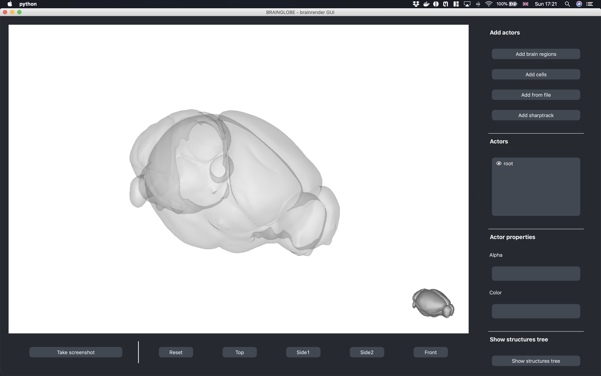

**To - Do**
- [x] command line interface: `-a` and `-axes` options
- [ ] add brain regions window: options for color and alpha 
- [ ] add cells, from file -> options for color and alpha
- [ ] more extensive tests.
- [ ] BUG: pip install followed by command line results in structures tree icons not loading:
> WARNING: Cannot open file '/Users/federicoclaudi/miniconda3/lib/python3.7/site-packages/brainrender_gui/icons/down_dark.svg', because: No such file or directory

 bg-brainrender-gui
`bg-brainrender-gui` is a `pyqt5` based GUI built around [`brainrender`](https://github.com/BrancoLab/BrainRender).

The goal of this program is to provide an easy to use graphical interface for `brainrender`, enabling the creation of 3d anatomical renderings with minimal coding requirements. 

Currently `bg-brainrender-gui` only supports some of `brainrender`'s core functionality, but we are happy to extend `bg-brainrender-gui` should there be interest in this. 

## Installation
Once the software will be released, it can be installed as a pithon package with `pip`.


## Usage
You can **start** `brainrender-gui` directly from your terminal with the command 
```
brainrender-gui
```

When using this command you can:
* Use the `-a` command followed by the name of a [brainglobe atlas api](https://github.com/brainglobe/bg-atlasapi) atlas to use the selected atalas (e.g. `brainrender-gui -a allen_human_500um`)
* Use the `-axes` flag to have axes rendered in the `brainrender` scene.


Starting `brainrender-gui` will open a window like this: 


The buttons on the right panel can be used to add, remove and edit elements of the `brainrender` scene.

### Adding actors
The first set of buttons is used to add elements to the brainrender scene
* `Add brain regions`: clicking on this button opens a new window where the user can input the names of the brain regions to be added to the brainrender scene. At this stage the user can also specify the transparency and color of the regions' mesh.
* `Add cells`: clicking on this button opens a dialog to select and load a file containing cell coordinates data (e.g. a `csv` file). At this stage the user can also specify the transparency and color of the cells' mesh.
* `Add from file`: clicking on this button opens a dialog to select and load a file for a 3d mesh (e.g. a `.obj` file). At this stage the user can also specify the transparency and color of the mesh.
* `Add sharptrack`: clicking on this button opens a dialog to select and load a `.m` file with the output of SHARPTRACK.

### Editing actors
Whenever an actor is added to the scene, its name will be added to the `Actors` list. The list can also be used to edit rendered actors:
* Double clickling an actor's name will toggle the visibility of the corresponding mesh. 
* A single click on an actor's name selects it for editing with the `alpha` and `color` options below the list. 

Once an actor is selected from the `Actors` list, its color and alpha will appear in the text boxes below. Editing the values in these textboxes change the corresponding actor's properties. 

### The hierarchy view
Pressing the `Show structures tree` button at the bottom right of the window shows a panel with the hierarchy view of brain regions in the selected atlas:


The hierarchy view can be used to explore the structures hierarchy as well as to add brain regions to the scene: clicking on a region's tickbox will add it to the list of actors in the scene. 
Press the same button again to hide the treeview.

# Getting in touch
For any issue, question or bug report regarding this software, please open an issue in the [github repository](https://github.com/brainglobe/bg-brainrender-gui).